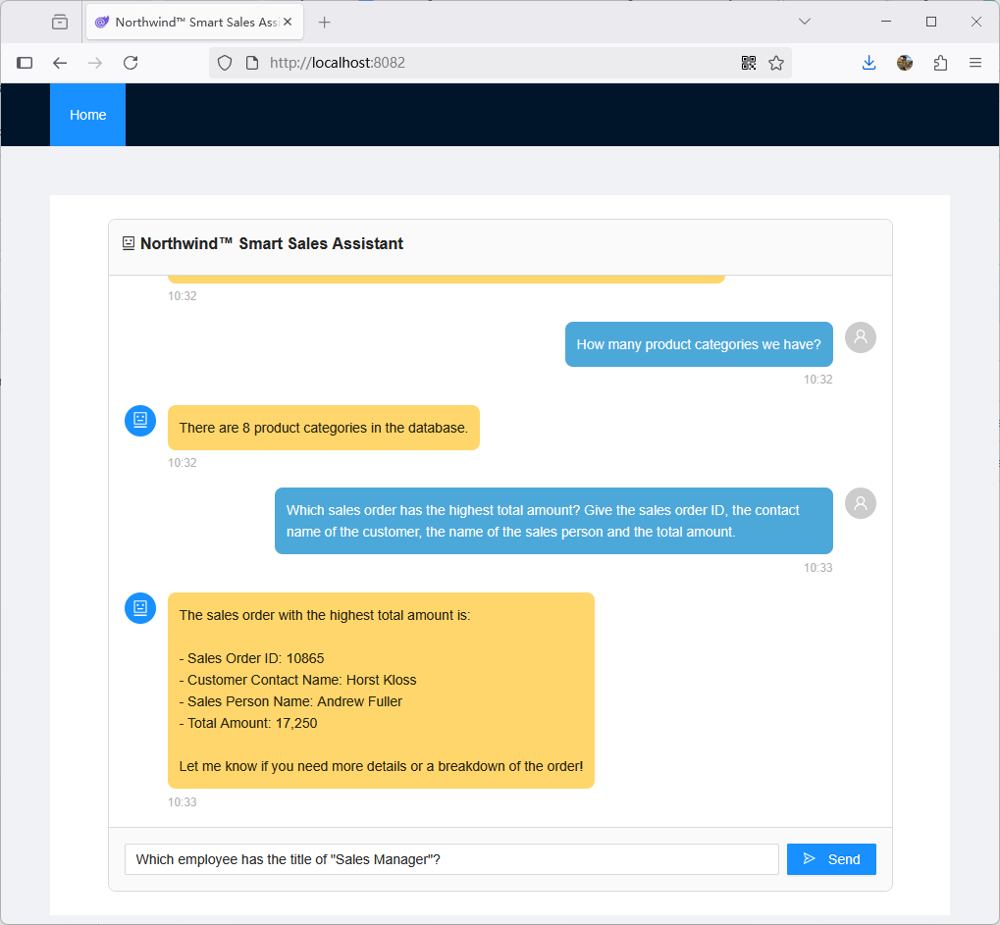
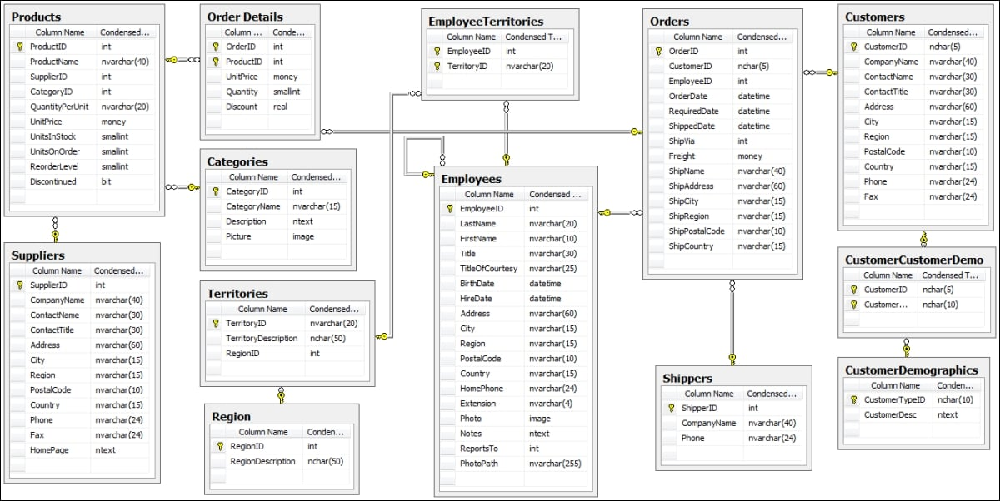
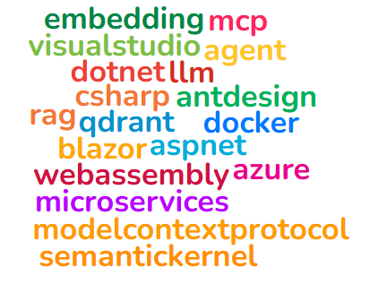

# Northwind Smart Store Assistant
This is a smart store sample application that demonstrates the NL-to-SQL data insights based on the famous Northwind database.



According to the description [here](https://github.com/yugabyte/yugabyte-db/wiki/Northwind-Sample-Database), Northwind database is:

>The Northwind database is an ancient old sample database that was originally created by Microsoft and used as the basis for their tutorials in a variety of database products for decades. The Northwind database contains the sales data for a fictitious company called “Northwind Traders,” which imports and exports specialty foods from around the world. The Northwind database is an excellent tutorial schema for a small-business ERP, with customers, orders, inventory, purchasing, suppliers, shipping, employees, and single-entry accounting.

The Entity Relationship Model (ERM) of the Northwind database is as following:



The goal of this sample application is to implement a natural language to SQL solution with which end users are able to use the natural language (e.g. English, Chinese, etc.) to talk to the system and get comprehensive explanation of the inventory and sales data.

## Architecture

This example uses LLMs (Large Language Models) with the combination of RAG and MCP agents to implement the NL-to-SQL and the SQL execution for providing structured data feedback and hence including the search results in the chat response message.

Following Data Flow Diagram (DFD) represents the basic architecture of the solution:


And following sequence is the workflow of the user query round trip:


## Frameworks, Tools & Technologies

The sample application used the following frameworks, tools and technologies:

- Development: Microsoft Visual Studio 2022
- Programming: Microsoft Visual C#, Github Copilot
- .NET: Microsoft .NET 9
- Backend:
    - Microsoft ASP.NET Core Web API
    - Microsoft Semantic Kernel
    - ModelContextProtocol with ASP.NET hosting
    - AI LLMs: Microsoft Azure AI Foundry
        - Chat Completion: gpt-4.1
        - Embedding: text-embedding-3-large
    - Vector Database: Qdrant
    - Relational Database: PostgreSQL
- Frontend:
    - Blazor WebAssembly
    - [Ant Design Blazor](https://antblazor.com/) component library



## Get Started

You can run the this sample app directly via docker compose, or use Microsoft Visual Studio 2022 to debug and develop the app.

### Run from Docker

Firstly make sure you've docker installed (either Docker Daemon under Linux or Docker Desktop on Windows / MacOS)

Use the following steps to build the docker images:

```bash
$ git clone https://github.com/daxnet/nw-smart-store
$ cd nw-smart-store/docker
$ docker compose build
```

After building all the docker images, under the same directory, create a docker envrionment file which holds the required environment variables. For example:

```bash
$ vim dev.env
```

This file should contain the following environment variable settings:

```text
CHAT_DEPLOYMENT=<Name of the Chat Completion Model deployment in Azure AI Foundry>
CHAT_ENDPOINT=<The endpoint of the Chat Completion Model deployed in Azure AI Foundry>
CHAT_APIKEY=<The API key of the Chat Completion Model deployed in Azure AI Foundry>
EMBEDDING_DEPLOYMENT=<Name of the Embedding Model deployment in Azure AI Foundry>
EMBEDDING_ENDPOINT=<The endpoint of the Embedding Model deployed in Azure AI Foundry>
EMBEDDING_APIKEY=<The API key of the Embedding Model deployed in Azure AI Foundry>
```

Remember to replace the values in the `<>` with the ones from your Azure AI Foundry model setup.

> Note: For now, this sample application only supports the LLMs deployed on Azure AI Foundry, Ollama is not supported at the moment. If you want to explore Ollama, clone this repo and DIY is a good idea.

After that, start the application with the following command:

```bash
$ docker compose --env-file dev.env up
```

Note that `dev.env` is the name of the docker environment file you created above.

After all containers are running, start a new shell, execute the following command to perform the initial indexing (vectorizing and embedding) of the reference document:

```bash
$ curl -X POST http://localhost:5030/api/search/build-index
```

This should inform you that the indexes were created successfully, then you're ready to go.

> If next time you've modified the reference document (`northwind_schema.en.json` or `northwind_schema.cn.json` and would like to rebuild the index / revectorize the reference document, then you should use `curl -X POST http://localhost:5030/api/search/build-index?force=true` instead)

> For the first time, while the PostgreSQL database container is initialized, it will import the Northwind database automatically, therefore, you will see a lot of "INSERT" messages in the console.

Open a web browser, navigate to `http://localhost:8082` to open the chat window.

### Run from Visual Studio (Debug)

Firstly you will need to provide the required environment variables:

```text
nss__ai__chat__deployment=<Name of the Chat Completion Model deployment in Azure AI Foundry>
nss__ai__chat__endpoint=<The endpoint of the Chat Completion Model deployed in Azure AI Foundry>
nss__ai__chat__apikey=<The API key of the Chat Completion Model deployed in Azure AI Foundry>
nss__ai__embedding__deployment=<Name of the Embedding Model deployment in Azure AI Foundry>
nss__ai__embedding__endpoint=<The endpoint of the Embedding Model deployed in Azure AI Foundry>
nss__ai__embedding__apikey=<The API key of the Embedding Model deployed in Azure AI Foundry>
```

This can be done by either setting them into your OS environment variable, or by editing the `Nss.ApiService/appsettings.Development.json` file.

Then execute the following command to start the docker containers for development:

```bash
$ cd nw-smart-store/docker
$ docker compose -f docker-compose.dev.yaml up
```

> For the first time, while the PostgreSQL database container is initialized, it will import the Northwind database automatically, therefore, you will see a lot of "INSERT" messages in the console.

Then open the solution file `nss.sln` in Visual Studio, start the following projects at the same time:

- Nss.ApiService
- Nss.McpServer
- Nss.WebApp

After everything is running, start a new shell, execute the following command to perform the initial indexing (vectorizing and embedding) of the reference document:

```bash
$ curl -X POST http://localhost:5030/api/search/build-index
```

This should inform you that the indexes were created successfully, then you're ready to go.

> If next time you've modified the reference document (`northwind_schema.en.json` or `northwind_schema.cn.json` and would like to rebuild the index / revectorize the reference document, then you should use `curl -X POST http://localhost:5030/api/search/build-index?force=true` instead)

Your chat window should already be opened in your default browser. But if not, navigate to `http://localhost:5282`

## References

- [Northwind database for Postgres](https://github.com/pthom/northwind_psql)
- [Building a Model Context Protocol Server with Semantic Kernel](https://devblogs.microsoft.com/semantic-kernel/building-a-model-context-protocol-server-with-semantic-kernel/)
- [Ant Design Blazor official web site](https://antblazor.com)
- [Building a RAG API with .NET, Semantic Kernel, Phi-3, and Qdrant: Enrich Your E-commerce Experience](https://elguerre.com/2025/04/22/%F0%9F%9A%80-building-a-rag-api-with-net-semantic-kernel-phi-3-and-qdrant-enrich-your-e-commerce-experience/)
